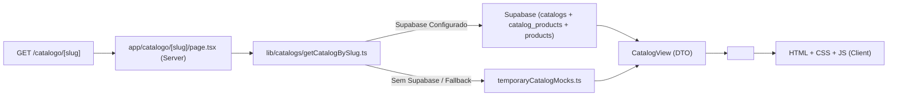

# Modulus - Sistema de Catálogos Dinâmicos

Sistema de catálogos públicos dinâmicos da Modulus, construído com Next.js 15 (App Router), React 19 e Supabase.

## Arquitetura

### Estrutura de Pastas Relevante

```
printing-calculator/
├── app/
│   ├── catalogo/
│   │   ├── page.tsx              # Página padrão (/catalogo)
│   │   └── [slug]/
│   │       └── page.tsx          # Rota dinâmica (/catalogo/[slug]) com SEO
├── components/
│   └── catalog/
│       └── CatalogoModulus.tsx   # Molde visual reutilizável (Client Component)
├── lib/
│   └── catalogs/
│       ├── getCatalogBySlug.ts   # Camada de busca de dados (Server)
│       └── temporaryCatalogMocks.ts  # Mocks locais para desenvolvimento
└── types/
    └── catalog.ts                # Contratos TypeScript (CatalogView, CatalogProductView)
```

### Fluxo de Dados



### Relação N:N (Catálogo ↔ Produto)

- **Tabela `catalogs`**: Metadados do catálogo (nome, slug, descrição, ativo)
- **Tabela `products`**: Dados intrínsecos do produto (nome, categoria, formato, imagem, preço)
- **Tabela `catalog_products`**: Junção com `display_order` para ordenação por catálogo

```sql
CREATE TABLE catalog_products (
    catalog_id UUID REFERENCES catalogs(id) ON DELETE CASCADE,
    product_id UUID REFERENCES products(id) ON DELETE CASCADE,
    display_order INT DEFAULT 0,
    PRIMARY KEY (catalog_id, product_id)
);
```

Um mesmo produto pode pertencer a múltiplos catálogos com ordens diferentes. Excluir um catálogo remove apenas as linhas em `catalog_products`, **não** o produto.

## Variáveis de Ambiente

Crie `.env.local` na raiz:

```env
# Públicas (lado cliente + servidor)
NEXT_PUBLIC_SUPABASE_URL=https://seu-projeto.supabase.co
NEXT_PUBLIC_SUPABASE_ANON_KEY=sua-chave-anon-publica

# Privada (APENAS servidor / Server Actions / Admin)
SUPABASE_SERVICE_ROLE_KEY=sua-chave-service-role-secreta
```

> **IMPORTANTE**: Nunca prefixe `SUPABASE_SERVICE_ROLE_KEY` com `NEXT_PUBLIC_`. Ela deve ficar restrita ao runtime do servidor.

## Como Rodar Localmente

```bash
# 1. Instalar dependências
npm install

# 2. Configurar variáveis (opcional - usa mocks se ausentes)
cp .env.example .env.local  # edite com suas credenciais

# 3. Desenvolvimento
npm run dev

# 4. Build de produção
npm run build && npm start
```

A rota `/catalogo` renderiza o catálogo padrão (`slug: "modulus"`).
A rota dinâmica `/catalogo/maker-home` e `/catalogo/deuses-gregos` demonstram múltiplos catálogos.

## Deploy (Vercel)

1. Conecte o repositório na Vercel.
2. Adicione as 3 variáveis de ambiente no painel (Project Settings → Environment Variables).
3. Deploy automático a cada push na branch principal.

## Segurança

- **RLS no Supabase**: Políticas permitem leitura pública apenas de catálogos/produtos `active = true`.
- **Service Role Key**: Usada apenas em Server Actions administrativas (`lib/supabase/server.ts → createAdminClient()`).
- **Validação de Slug**: Sanitização no servidor antes da query.
- **Sem XSS**: Nenhum uso de `dangerouslySetInnerHTML`; textos dinâmicos renderizados como nós React.

## Mocks de Desenvolvimento

O arquivo `lib/catalogs/temporaryCatalogMocks.ts` contém 3 catálogos de exemplo:

| Slug | Título | Produtos |
|------|--------|----------|
| `modulus` | Catálogo | 16 |
| `maker-home` | Maker Home | 3 (com preços) |
| `deuses-gregos` | Deuses Gregos | 2 (com preços) |

Eles demonstram:
- Categorias e formatos contextuais por catálogo
- Produtos com/sem preço (`Sob consulta` vs valor formatado)
- Produtos com/sem imagem secundária (`photoSecondary`)
- Diferentes textos de hero e manifesto

## Scripts Úteis

```bash
npm run dev       # Servidor de desenvolvimento (Turbopack)
npm run build     # Build de produção + type-check
npm run start     # Servidor de produção
npm run lint      # ESLint
```

## Próximos Passos (Roadmap)

1. **CRUD Admin Completo** - Formulários de catálogo/produto com drag-and-drop de `display_order`
2. **Upload Supabase Storage** - Integração direta nos formulários admin
3. **ISR / Revalidação** - `revalidatePath('/catalogo/[slug]')` após edições admin
4. **Página de Produto** - Rota `/catalogo/[slug]/produto/[productSlug]`
5. **Busca Full-Text** - Índice Postgres `tsvector` ou Meilisearch/Algolia